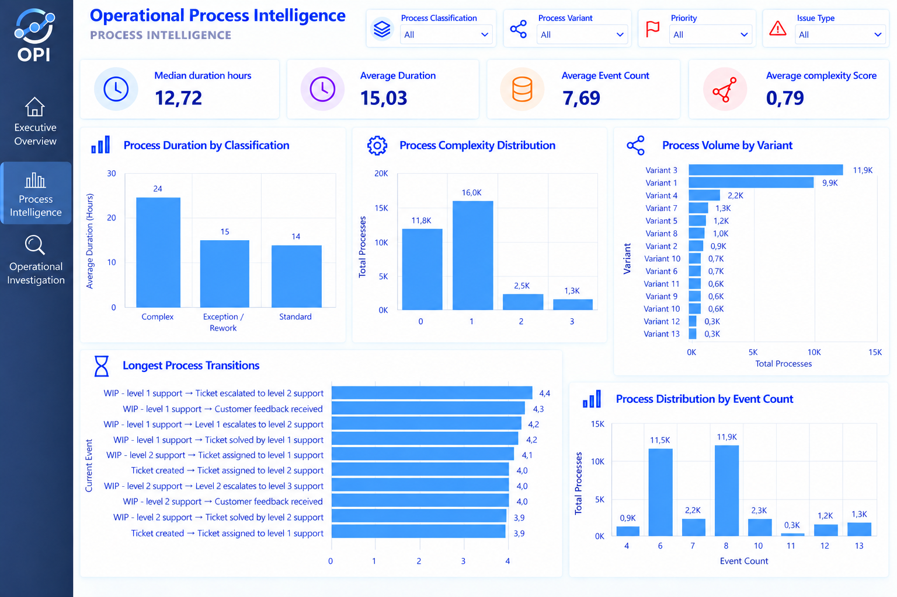
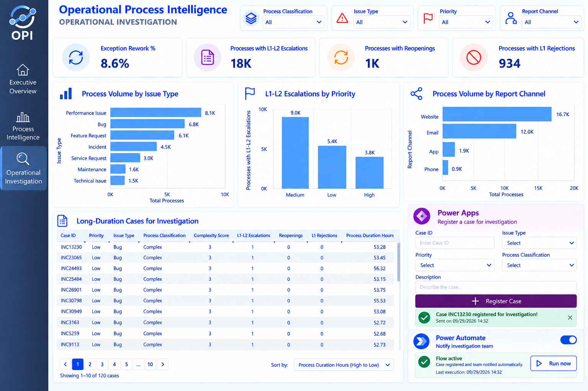
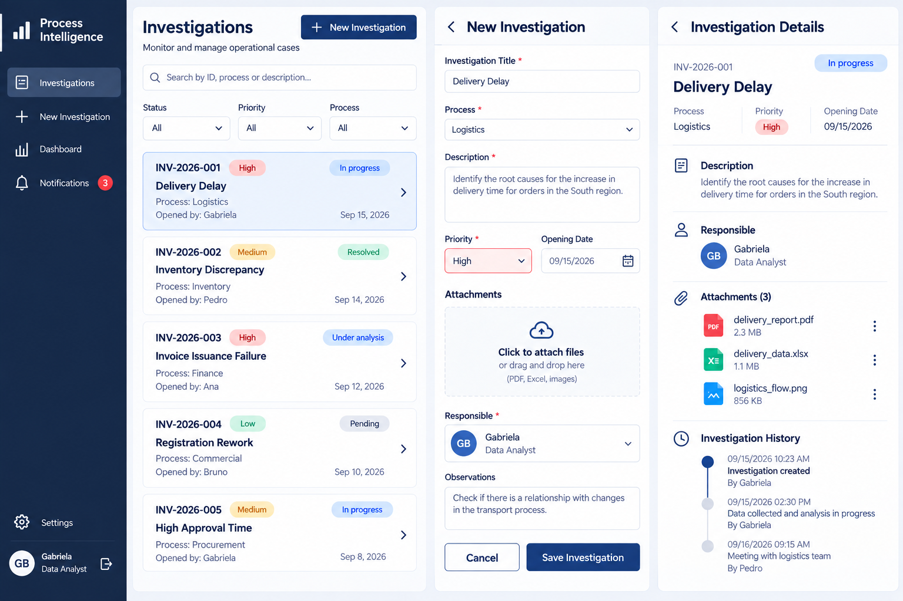
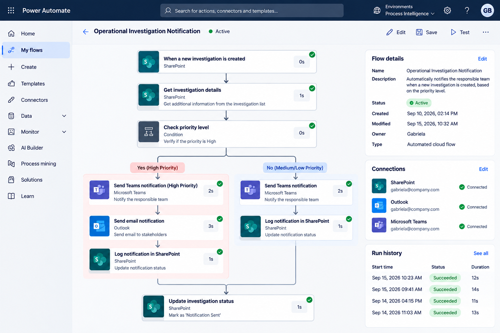

# Operational Process Intelligence

### Process Analytics, Data Quality & Workflow Automation

An end-to-end operational intelligence solution designed to transform process event data into actionable insights, investigation workflows, and automated follow-up.

## Project Overview

Operational Process Intelligence analyzes event-log data to understand how operational processes behave, where time is concentrated, and which cases require investigation.

The solution combines:

**Data → Python/ETL → Data Quality → SQL/PostgreSQL → Power BI → Power Apps → Power Automate**

The project demonstrates how data can move from raw operational events to:

- Process performance analysis
- Data quality assessment
- Process complexity classification
- Operational investigation
- Business intelligence dashboards
- Investigation workflows
- Automated notifications

## Business Problem

Operational processes often generate large volumes of event data, but identifying bottlenecks, rework, escalations, and high-duration cases can be difficult.

This project addresses questions such as:

- How long do processes take?
- Where is process time concentrated?
- Which processes are more complex?
- How frequently do escalations, rejections, and reopenings occur?
- Which cases should be investigated?
- How does operational complexity relate to customer satisfaction?
- How can analytical findings trigger operational action?

## Solution Architecture

```text
Process Event Log
        ↓
Python / ETL
        ↓
Data Quality
        ↓
PostgreSQL
        ↓
Operational SQL Analysis
        ↓
Power BI
        ↓
Investigation Workflow
        ↓
Power Apps
        ↓
Power Automate
        ↓
Notification & Follow-up

Dataset
The project uses the Process Mining Event Log – Incident Management dataset.
Dataset characteristics:
- 31,588 process cases
- 242,901 event records
- 13 process variants
- 18 event types
- 3 priority levels
- 7 issue types
- 10 resolvers
- 4 report channels
- Customer satisfaction score from 1 to 5
Each Case ID represents a process containing multiple operational events.
Data Processing
Python was used to prepare and analyze the process data, including:
- Event-log processing
- Case-level aggregation
- Process duration calculation
- Event counting
- Operational event classification
- Complexity scoring
- Process classification
Process Classification
Cases are classified according to operational complexity:
IF Exception_Rework = 1
    → Exception / Rework

ELSE IF Complexity_Score >= 2
    → Complex

ELSE
    → Standard

Process Intelligence
The analysis identified:
- Average process duration: 15.03 hours
- Median process duration: 12.72 hours
- Average event count: 7.69
- Average complexity score: 0.79
Operational Events
Key operational behaviors include:
- L1 → L2 escalations: 18,216 cases
- L2 → L3 escalations: 1,979 cases
- Customer reopenings: 1,188 cases
- L1 rejections: 934 cases
- L2 rejections: 606 cases
Process Classification Results
Classification	Cases	Share	Avg. Duration	Avg. CSAT
Standard	26,881	85.10%	14.43 h	3.38
Exception / Rework	2,728	8.64%	14.63 h	2.62
Complex	1,979	6.27%	23.78 h	2.47


The results are descriptive and are not intended to establish causal relationships.
Data Quality
The analysis also evaluates data quality before operational interpretation.
Key findings include:
- 96,496 missing Resolver values
- Missing Resolver values are structurally associated with specific event types
- No invalid timestamps were identified
- Timestamp coverage ranges from January 2023 to January 2024
Missing Resolver values were retained as NULL rather than artificially imputed or removed.
PostgreSQL
The project uses PostgreSQL for structured process analysis.
Main tables:
process_analysis
process_events
A dedicated process transition view was also created:
process_event_transitions
The transition analysis calculates:
- Transition frequency
- Average transition duration
- Median transition duration
This enables the identification of operational transitions where time is concentrated.
Power BI
The Power BI solution contains three analytical perspectives.
### 1. Executive Overview

**What is happening?**

Provides an executive-level view of:

- Process volume
- Average duration
- Customer satisfaction
- Exception / Rework rate
- Process classification
- Operational duration gaps


### 2. Process Intelligence

**How do processes behave?**

Analyzes:

- Process duration
- Process complexity
- Event count
- Process variants
- Longest process transitions
- Process distribution



### 3. Operational Investigation

**Where should we investigate?**

Focuses on:

- Issue types
- Report channels
- Priority
- Escalations
- Reopenings
- Rejections
- Long-duration cases requiring investigation



## Investigation Workflow

The project extends the analytical layer into an operational workflow.

### Power Apps

A conceptual investigation interface was designed to support the registration and follow-up of operational cases.



### Power Automate

A conceptual automated workflow was designed to notify the responsible team when an investigation is created, based on its priority.



> The Power Apps and Power Automate interfaces are presented as conceptual workflow designs for the portfolio architecture.

operational-process-intelligence/
│
├── data/
│   ├── process_analysis.csv
│   └── process_mining_event_log.zip
│
├── python/
│   └── 01_process_analysis.py
│
├── sql/
│   ├── 01_create_process_analysis.sql
│   └── 02_operational_analysis.sql
│
├── powerbi/
│
├── powerapps/
│   └── Case_Investigation_App.png
│
├── powerautomate/
│   └── Operational_Investigation_Notification.png
│
├── images/
│   ├── Executive_Overview.png
│   ├── Process_Intelligence.png
│   └── Operational_Investigation.png
│
└── docs/
Technologies
- Python
- Pandas
- SQL
- PostgreSQL
- Power BI
- DAX
- Power Apps
- Power Automate
- Process Mining
- Data Quality
- ETL
Key Takeaways
The project demonstrates an end-to-end approach to operational intelligence:
Analyze → Understand → Investigate → Act → Automate
The objective is not only to visualize operational data, but to connect analytical findings with an operational response and follow-up workflow.

### Depois de colar

Na parte de baixo do GitHub:

**Commit changes**

Mensagem:

```text
Update project README
