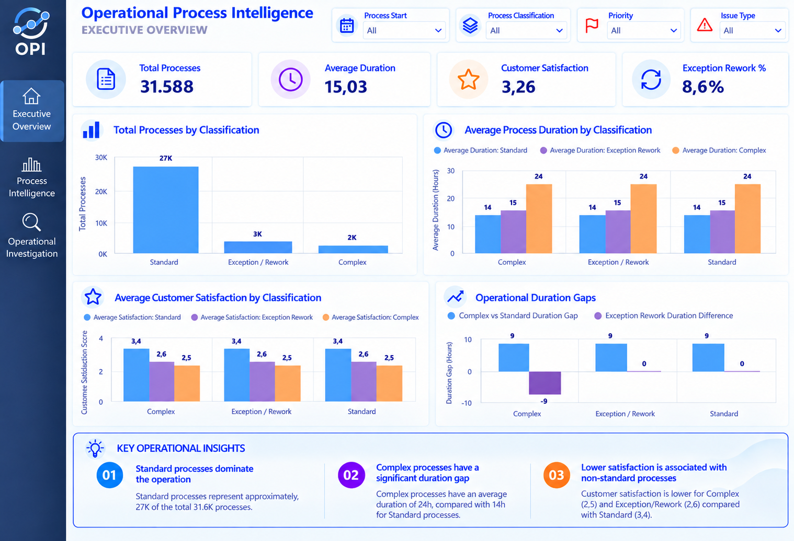

# Power BI Report

The original Power BI report is not included in this repository because the `.pbix` file is not stored in GitHub. The dashboard is represented through screenshots available in the `images` folder.

The dashboard includes:

- Executive Overview
- Process Intelligence
- Operational Investigation
- Process Classification Analysis
- Process Duration Analysis
- Process Complexity Analysis
- Operational Event Analysis
- Key Process Performance Indicators
- Investigation-focused case analysis

## Dashboard Pages

### Executive Overview

Provides a high-level view of:

- Total processes
- Average process duration
- Customer satisfaction
- Exception / Rework rate
- Process classification
- Operational duration gaps

### Process Intelligence

Analyzes how processes behave across different operational dimensions, including:

- Process duration
- Process complexity
- Complexity distribution
- Process variants
- Event count distribution
- Event transitions

### Operational Investigation

Focuses on identifying cases and operational areas that require deeper investigation.

The page analyzes:

- Issue types
- Report channels
- Priorities
- L1-L2 escalations
- Reopenings
- L1 rejections
- Long-duration cases
- Complex and Exception / Rework processes

## Power BI Model

The Power BI model uses PostgreSQL as the primary data source.

The main analytical tables are:

- `process_analysis`
- `process_events`
- `process_event_transitions`

The model connects process-level analysis with event-level information through the `case_id` field.

## Dashboard Preview

### Executive Overview

### Process Intelligence

### Operational Investigation

## Key Metrics

The dashboard includes key operational metrics such as:

- Total Processes
- Average Process Duration
- Median Process Duration
- Average Customer Satisfaction
- Average Complexity Score
- Average Event Count
- Exception / Rework Rate
- L1-L2 Escalations
- Reopenings
- L1 Rejections

## Technologies

- Power BI
- DAX
- Power Query
- PostgreSQL
- SQL
- Python
